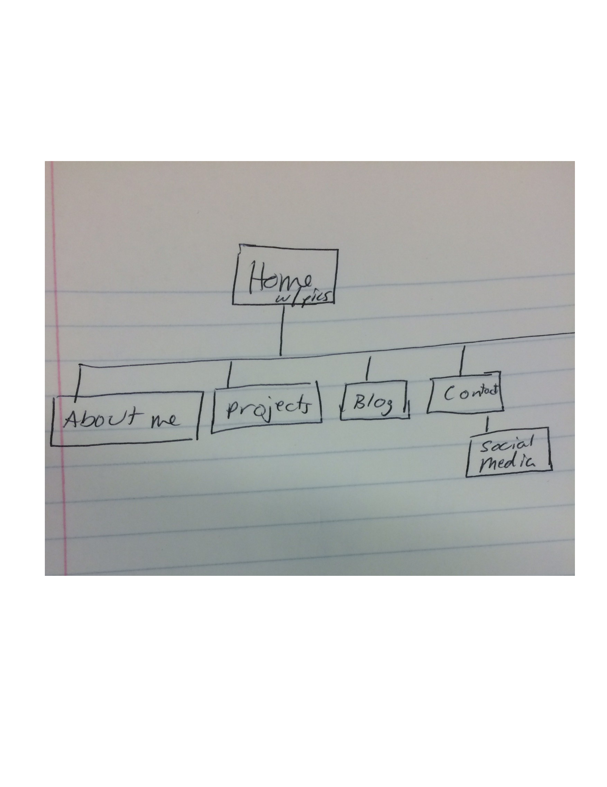

1.	What are the 6 Phases of Web Design?
-Info Gathering
-Planning
-Design
-Development
-Testing and Delivery
-Maintenance

2.	What is your site's primary goal or purpose? What kind of content will your site feature?
This is a great question since I just found out that I was making this site. I’m going to be more engaged if I can see a real use for this site, so I’m going to look at my this as a way to market myself to do freelance work after I finish DBC. So, the content will be projects that I work on that I’m proud of, skills that I develop through DBC and from prior experience, etc. Who knows if I’ll actually pursue this a few months down the road, but this will at least give me a useful purpose to aim for.

3.	What is your target audience's interests and how do you see your site addressing them?
My most general target audience will be anyone interested in paying me to do some sort of web development or coding. Given my background, perhaps I could target non-profits or political organizations/campaigns more specifically. Those are worlds that I’m familiar with and might be able to make connections more easily. These are also groups that may not have the funding or know-how to create really useful websites or web applications, but they could greatly benefit.

4.	What is the primary "action" the user should take when coming to your site? Do you want them to search for information, contact you, or see your portfolio? It's ok to have several actions at once, or different actions for different kinds of visitors.
I want them to look around, check out at my portfolio, identify needs that their organization has, think that I’m the person to fulfill those needs, contact me, and tell all their friends and colleagues to do the same.

5.	What are the main things someone should know about design and user experience?
Some of the main things to consider when planning your design are colors and color palettes, fonts, scale, and responsive web design. And, most importantly, plan! There are lots of resources online to help with all of this. Although user experience hasn’t always been a primary focus, it’s important. The better the user experience, the more people will return to your site and recommend it to others.

6.	What is user experience design and why is it valuable? 
User experience design is designing a website or application while intentionally considering the users’ experience. Will the site be pleasant or difficult to navigate?  Will the target audience intuitively know where to go on the site to get what they are looking for? Will the user be overwhelmed by information or find manageable pieces of information prioritized in a way that’s easy to navigate? Better user experience makes your site or application more valuable.

7.	Which parts of the challenge did you find tedious?
I didn’t find this challenge to be tedious. I looked at some interesting resources about design and then made a little site map. What’s tedious about that?
