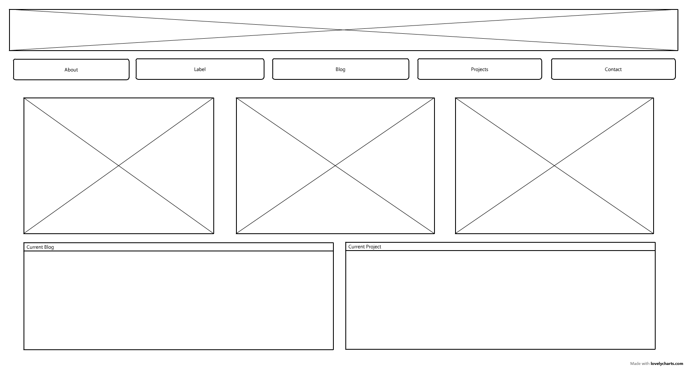
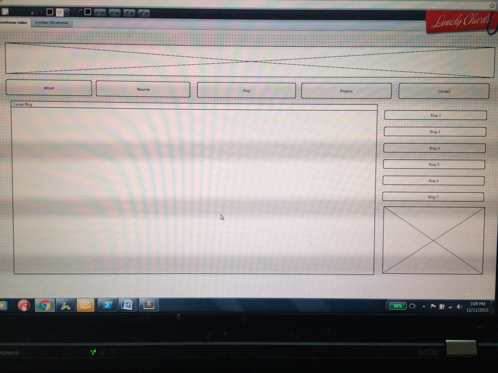

What is a wireframe?
A wireframe is diagram of what your webpage will look like. With a wireframe, you have a plan for what you're creating before you begin to create it. It's a good idea to create a number of sketches and/or wireframes with different ideas before you begin to actually create your webpage so you don't get invested in an idea that's subpar just because you've put a lot of time and effort into it.

What are the benefits of wireframing?
The benefits of wireframing are making the coding process fastaer and easier because you have a plan going in, and you can look at the wireframe to consider things like user experience, how everything you want on the page will fit together, how a user will navigate the site, etc. before you invest a lot of time into coding.

Did you enjoy wireframing your site?
I did enjoy wireframing my site. I like having a plan. I think I'll enjoy this more once I'm working on something more complex and have a little experience under my belt. I'm not incredibly good at design type stuff, so to some extent I felt like I was only working with a handful of things to put into my wireframe and I didn't have a ton of creative ideas. So, I think this will be more fun in the future once I have more pieces to play with and more experience thining about cool ways to put the pieces together.

Did you revise your wireframe or stick with your first idea?
I stuck pretty close to my original idea, but changed it a little based on a couple of later drafts.

What questions did you ask during this challenge? What resources did you find to help you answer them?
The main question I had was basically, how to think of different and good layout ideas? I looked at a few sites for ideas.

Which parts of the challenge did you enjoy and which parts did you find tedious?
I didn't find this challenge to be tedious. I like the idea of having a plan, and it was fun to sketch out ideas and then make a wireframe. The main hangup I had is just feeling like I'm not coming up with interesting and creative ideas. I'm going to have to work someplace that has a good designer. :)