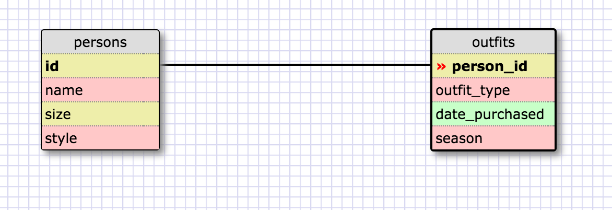

Query 1: SELECT * FROM states;
Query 2: SELECT * FROM regions;
Query 3: SELECT state_name, population FROM states;
Query 4: SELECT state_name, population FROM states ORDER BY population DESC;
Query 5: SELECT state_name FROM states WHERE region_id = 7;
Query 6: SELECT state_name, population_density FROM states WHERE population_density > 50 ORDER BY population_density ASC;
Query 7: SELECT state_name FROM states WHERE population BETWEEN 1000000 AND 1500000;
Query 8: SELECT state_name, region_id FROM states ORDER BY region_id ASC;
Query 9: SELECT region_name FROM regions WHERE region_name LIKE '%central%';
Query 10: SELECT regions.region_name, states.state_name FROM states INNER JOIN regions ON states.region_id = regions.id ORDER BY region_id ASC;

What are databases for?
Databases are for storing large amounts of data in a way that is organized
and searchable.
What is a one-to-many relationship?
A one-to-many relationship refers to a piece of data that belongs to a larger grouping. For example, "Africa" has a one-to-many relationship with "continents."
What is a primary key? What is a foreign key? How can you determine which is which?
A primary key is a unique identifer for each row in a table that can be used to
connect that table with other tables.
A foreign key is the column that contains the primary key of another table.
One way to tell them apart is that primary keys must be unique, but foreign keys
don't. If there are duplicate values, then those aren't primary keys.
How can you select information out of a SQL database? What are some general guidelines for that?
You can select info by using the SELECT command. Type SELECT, then the column or
columns (separated by a comma) that you want, or * for everything. Then type FROM
and the name of the database. You can get more specific by using WHERE to select
only data that is greater than, lesser than, equal to or between certain values.